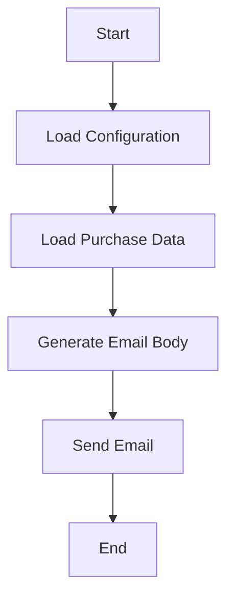

# README

## 1) Application Overview

This application aims to send a fictional purchase confirmation email with details about the transaction and a PDF attachment simulating an Invoice (non-real data).

The application flow is based on fictional data intended solely for educational purposes, allowing users to understand how to structure and send emails automatically.

## 2) How It Works

- **Data Loading:** The application loads purchase data from a JSON file.

- **Email Body Generation:** An email body is generated from an HTML template.

- **Read File:** The data reading file prepares the information so that the HTML can be populated with purchase data at the time of sending.

- **Email Configuration:** The necessary configurations to send the email (such as SMTP server, credentials, and recipient) are loaded from a YAML file. It is important that both sending and receiving emails are real for it to.

 
>**IMPORTANT!**  
> - Be careful with your personal information.
>
> - If your email has two-factor authentication, it is essential to generate an App Password for it to work. 
>
> - Check your email server's documentation for instructions on how to do this!
>
> - When uploading this code to any repository, remember to remove your personal data beforehand.

5. **Email Sending:** The email is sent to the specified recipient, including an attachment if available.

## 3) Classes and Functions

### 3.1) Classes

- **EmailDataLoader**
  - **Methods**:
    - `load_data(json_file)`: Loads purchase data from a JSON file.

- **EmailBodyGenerator**
  - **Methods**:
    - `__init__(template_file)`: Initializes the generator with an HTML template
    - `generate(data)`: Generates the email body using the provided data.

- **EmailConfigLoader**
  - **Methods**:
    - `load_config(config_file)`: Loads email configuration from a YAML file.

- **EmailSender**
  - **Methods**:
    - `__init__(sender_email, sender_password, config_file)`: Initializes the email sender.
    - `send_email(recipient, email_body, attachment_path, subject)`: Sends the email with the specified body and attachment.

### 3.2) Main Functions

- **Main**: Responsible for coordinating data loading, email generation, and sending.

## 4) Data

The data used in the application is fictional and aims to demonstrate the functionality of the application for educational purposes. It should not be used in production environments.

## 5) Flow Diagram


## 6) Repository Cloning Instructions

To clone this repository, use the following command:

```bash

git clone <URL do repositório>
```
## 7) Installation Instructions

- Ensure you have Python installed on your machine.
- Navigate to the cloned repository directory.
- Create a virtual environment:

```bash
    Python -m venv ."nome do ambiente"
```

- Activate the virtual environment:
```bash
    .\."nome do ambiente"\Scripts\Activate
```
- Install the necessary dependencies using the following command:

```bash
    pip install -r requirements.txt
```
## 8) Usage Instructions

### 8.1) Configuration

  - Edit the config.yaml file to add the recipient's email, the sender's email and password, and the path to the attachment.

  - Modify the sales_data.json file with the desired fictional purchase data.

  - Customize the email_template.html file as needed.

  - Add an attachment file to the data repository if desired.
How to Run

  - o execute the application, use the following command from the project root:

  - Para executar a aplicação, utilize o seguinte comando a patir da raiz do projeto:

  ```bash
      python main.py
  ```

## 9) Author Information

Developed by Rafael Rodrigues - rafael.rodrigues85@hotmail.com


## 10) Copyright

This project is licensed under Creative Commons Attribution - Non-Commercial (CC BY-NC).

© 2024. All rights reserved.


